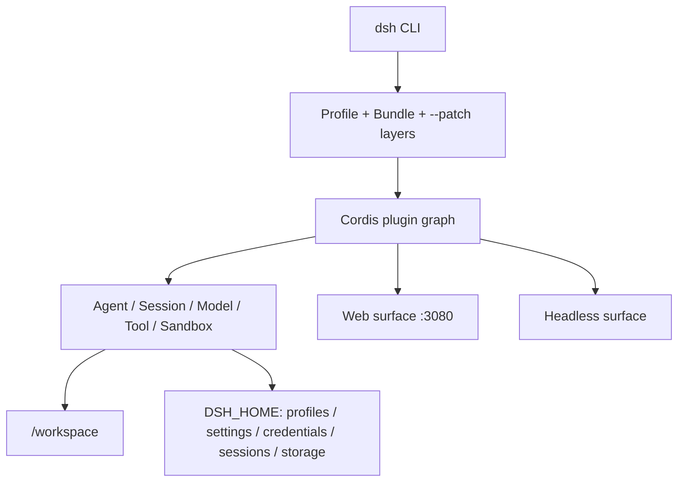

# DeepSeek Harness Docker

English | [简体中文](README.md)

[](https://www.npmjs.com/package/@deepseek-ai/dsh)
[](https://hub.docker.com/r/runzhliu/deepseek-harness)
[](https://nodejs.org/)
[](LICENSE)

A production-minded community container project for the official DeepSeek Harness `@deepseek-ai/dsh` package. It provides a multi-stage Dockerfile, a hardened Compose setup, and a single-replica StatefulSet Helm chart without forking or rebuilding the upstream monorepo.

> Current baseline: `@deepseek-ai/dsh@0.1.0-rc.6`. DeepSeek Harness is still a release candidate. Re-run the build and smoke tests before every version upgrade.

`0.1.0-rc.6` maps directly to the latest official `@deepseek-ai/dsh` artifact in the npm Registry at build time; it is not a project-defined version. The public upstream `master` still identified itself as `rc.5` at that point. This project packages the installable npm distribution instead of building source, and intentionally does not publish a drifting Docker `latest` tag.

📖 Further reading: [DeepSeek Harness architecture, runtime mechanics, and cloud-native containerization](https://aik8s.run/ai-k8s/rag-agent/deepseek-harness-runtime-containerization/) (Chinese)


## Project status

| Capability | Status | Evidence |
| --- | --- | --- |
| Dockerfile | Ready | `linux/arm64` and `linux/amd64` builds and real native PTY spawning tested |
| Docker Compose | Ready | HTTP 200, healthy state, loopback publication, and persistence across restart tested |
| Helm | Ready | StatefulSet, PVC, headless Service, and NetworkPolicy; `helm lint --strict` passes |
| Web UI | Local single-user only | No authentication; never expose directly to a LAN or the Internet |
| Headless | Ready | Inject provider secrets at runtime; validate model calls and sandboxing in the target environment |

## Deep dive: understanding DeepSeek Harness

This section is a condensed companion to the full [aik8s.run technical article](https://aik8s.run/ai-k8s/rag-agent/deepseek-harness-runtime-containerization/) covering architecture, Agent turns, persistence, the security model, and the container verification matrix.

### What it is—and what it is not

[DeepSeek Harness](https://github.com/deepseek-ai/deepseek-harness) is not a model checkpoint or inference server. It is a TypeScript AI Agent runtime that composes model adapters, sessions, tools, permissions, workspaces, plugins, a Web UI, and a Headless entry point. Its end-user distribution is the [`@deepseek-ai/dsh`](https://www.npmjs.com/package/@deepseek-ai/dsh) CLI. The right topic for this project is “cloud-native packaging for an AI Agent runtime,” not “LLM inference deployment.”

As of 2026-08-13, the upstream repository has no Dockerfile, Compose file, or Kubernetes manifests. Its [`CONTRIBUTING.md`](https://github.com/deepseek-ai/deepseek-harness/blob/master/CONTRIBUTING.md) also says that external pull requests are not currently accepted and explicitly encourages ecosystem projects and how-to guides. This repository is therefore an independent community implementation, not an official image.

### Runtime layers



1. **CLI and profiles.** `dsh web` is an alias for the Web profile, while `dsh --profile headless` serves automation and one-shot tasks. A profile is a layered composition: base bundles, surface bundles, the user's patch, and command-line `--patch` overlays.
2. **Cordis composition.** Harness models capabilities such as the Web server, model adapters, sessions, tools, and the directory picker as a Cordis plugin graph. Dependency injection controls activation, while stable entry IDs allow later patch layers to replace configuration. This project uses that supported seam to provide container-only bind configuration instead of patching upstream code.
3. **Agent core.** Model routing, system prompts, session persistence, tool execution, goals, subagents, and workspaces are Host-side services. The browser is a client of this runtime, not a second Agent implementation.
4. **Surfaces.** The Web surface provides interactive browser access. The Headless surface supports terminals, CI, and batch automation. Both reuse the same core plugin graph and `$DSH_HOME` data model.

### State and persistence

`DSH_HOME` is the central container boundary. This image fixes it at `/home/node/.dsh`, which stores:

- `profiles/`: package metadata, Cordis configuration, and user patches;
- `settings.yaml` and credential files: model settings and managed credentials or Secret references;
- `sessions/`: session logs;
- `storages/`: Workspace and other domain state.

User code lives separately at `/workspace`. Compose combines a named `dsh-home` volume with a workspace bind mount. Helm uses a `dsh-home` PVC and optionally mounts another existing PVC through `workspace.existingClaim`. The image can therefore be rebuilt without deleting configuration and sessions.

### Why this is more than `FROM node` plus `npx`

| Problem | Upstream behavior | Project decision |
| --- | --- | --- |
| Node version | Requires Node 22.19+ or 24+ | Pin Node 24 slim |
| Native dependency | `node-pty` lacks prebuilds for some architectures | Compile in a builder stage; keep compilers out of the runtime image |
| Web bind | The CLI intentionally rejects `--host 0.0.0.0` | Use a Cordis overlay and publish only to host `127.0.0.1` |
| Web security | No TLS, authentication, or origin policy; tools can execute code | No Ingress/LoadBalancer; loopback-only Compose; deny Pod ingress by default |
| HMR | A config watcher needs Node internals after boot | Pass `--expose-internals` only to the DSH process, never through inherited `NODE_OPTIONS` |
| Directory browser | Starts at `os.homedir()` | Point `HOME` at writable `/workspace` instead of read-only `/home/node` |
| Child processes | Agents can create shell and PTY subprocesses | Use `tini` for signal forwarding and orphan reaping |
| Least privilege | The workspace must be writable without exposing the host | UID 1000, read-only root, drop ALL, no-new-privileges, and minimal mounts |

The Web bind is the most important trade-off. Docker bridge publication requires the process to listen beyond the container loopback interface, while Harness deliberately rejects `--host 0.0.0.0` to prevent accidental exposure of an unauthenticated code-execution surface. The container overlay changes only the internal listener. The deployment boundary then restores the intended posture: Compose binds the host side to `127.0.0.1`, and Kubernetes access uses `kubectl port-forward`. Changing this to `-p 3080:3080`, NodePort, LoadBalancer, or a public Ingress breaks the security model.

### Container isolation versus the Harness sandbox

These are complementary layers:

- Docker or Kubernetes decides which host paths, Linux capabilities, and resources the process can see.
- Harness decides what Agent tools may do inside that already constrained filesystem.

Linux Landlock, user namespaces, and native helpers depend on the host kernel and container runtime. This project will not hide sandbox failures with `--privileged`, a Docker socket, or extra capabilities. A release check must include a real filesystem and shell tool call in the target environment; an HTTP 200 response proves only that the UI started.

### Why the Helm chart uses a StatefulSet

Profiles, model settings, credentials, sessions, and Workspace indexes are stateful. The current single-user Web surface is also not designed for uncoordinated horizontal replicas writing the same state. The chart therefore fixes one StatefulSet replica, mounts a stable `dsh-home` PVC, retains that PVC across uninstall, and deliberately avoids pretending that a higher replica count would provide high availability. Multi-replica service deployment should wait for upstream authentication, tenant isolation, and concurrency-safe shared storage.

## Why not just use `npx` in a container?

This image handles the container boundaries that a one-line image misses:

- pins and verifies the exact DSH version during build;
- runs as a non-root user behind `tini`;
- persists configuration, credentials, sessions, and storage under `/home/node/.dsh`;
- makes `/workspace` the writable interactive home used by the Web directory browser;
- compiles native modules in a disposable builder stage;
- uses a container-only Cordis bind overlay while keeping host publication on loopback.

DeepSeek Harness Web currently has no TLS, authentication, or origin policy, and its API can initiate code execution. This project supports a **trusted, local, single-user development environment**, not a directly exposed network service.

## Quick start with Docker Compose

From this directory:

```bash
docker compose pull
DSH_WORKSPACE=/absolute/path/to/your/project docker compose up -d --no-build
docker compose ps
```

Open <http://127.0.0.1:3080> and configure a model and credentials in Settings. The named `dsh-home` volume survives container recreation.

The default image is [`runzhliu/deepseek-harness:0.1.0-rc.6`](https://hub.docker.com/r/runzhliu/deepseek-harness). Compose retains the `build` definition so the image remains reproducible and reviewable; run `docker compose build --pull` before startup when you explicitly want a local build.

Inspect logs or stop the service:

```bash
docker compose logs -f deepseek-harness
docker compose down
```

`docker compose down` preserves the named volume. `docker compose down --volumes` intentionally deletes stored configuration, credentials, and sessions.

## Plain Docker

Build:

```bash
docker build -t runzhliu/deepseek-harness:0.1.0-rc.6 .
```

Run the Web UI:

```bash
docker volume create dsh-home
docker run --rm \
  --name deepseek-harness \
  --publish 127.0.0.1:3080:3080 \
  --mount type=volume,src=dsh-home,dst=/home/node/.dsh \
  --mount type=bind,src="$PWD",dst=/workspace \
  runzhliu/deepseek-harness:0.1.0-rc.6
```

Do not shorten the publication to `-p 3080:3080`, and do not place this service behind a public Ingress.

## Headless mode

Arguments replace the default Web command because the image entry point behaves like `dsh`:

```bash
docker run --rm \
  --env DEEPSEEK_API_KEY \
  --mount type=volume,src=dsh-home,dst=/home/node/.dsh \
  --mount type=bind,src="$PWD",dst=/workspace \
  runzhliu/deepseek-harness:0.1.0-rc.6 \
  --profile headless "summarize this repository"
```

Inject API keys at runtime through environment variables, Secrets, or Web settings. Never place them in a Dockerfile, image layer, or build argument.

## Kubernetes with Helm

`charts/deepseek-harness` deploys one StatefulSet replica. `/home/node/.dsh` is backed by a PVC; the workspace can use another existing PVC. The chart creates no Ingress or LoadBalancer and enables a deny-ingress NetworkPolicy by default.

The chart defaults to the published Docker Hub image, so it can be installed directly:

```bash
helm upgrade --install deepseek-harness charts/deepseek-harness \
  --namespace deepseek-harness \
  --create-namespace \
  --set image.repository=runzhliu/deepseek-harness \
  --set image.tag=0.1.0-rc.6
```

Kind or Minikube can pull the default `runzhliu/deepseek-harness` image directly, or you can load a local image under the same name first.

Access it through the Kubernetes API server:

```bash
kubectl -n deepseek-harness rollout status statefulset/deepseek-harness
kubectl -n deepseek-harness port-forward service/deepseek-harness 3080:3080
```

Then open <http://127.0.0.1:3080>. Do not convert the unauthenticated code-execution surface into a NodePort, LoadBalancer, or direct Ingress.

Create a provider Secret without putting its value in `values.yaml`:

```bash
kubectl -n deepseek-harness create secret generic dsh-provider-credentials \
  --from-literal=DEEPSEEK_API_KEY='replace-me'

helm upgrade deepseek-harness charts/deepseek-harness \
  --namespace deepseek-harness \
  --reuse-values \
  --set credentials.existingSecret=dsh-provider-credentials
```

Set `workspace.existingClaim` to mount a persistent workspace PVC. Without it, `/workspace` is an `emptyDir`. The StatefulSet-created `dsh-home` PVC is retained after Helm uninstall; delete it manually only when you intend to erase configuration, credentials, and sessions.

## Upgrade the DSH version

The build argument pins the package:

```bash
docker build \
  --build-arg DSH_VERSION=0.1.0-rc.6 \
  -t runzhliu/deepseek-harness:0.1.0-rc.6 .
```

Compose uses the same variable:

```bash
DSH_VERSION=0.1.0-rc.6 docker compose build --pull
```

Do not install an unbounded `latest` tag. Release-candidate behavior changes quickly, and exact versions make bugs reproducible.

## Security boundary

- The image runs as `node` (UID/GID 1000). Fix bind-mount ownership or build a derived image with a matching UID when the host workspace is not writable.
- The Web directory browser's Home is `/workspace`; it is intentionally separate from internal state under `/home/node/.dsh`.
- Compose drops all capabilities, sets `no-new-privileges`, uses a read-only root filesystem, and provides a dedicated `/tmp` tmpfs.
- Mount only the workspace the Agent needs. Never mount the host root, `~/.ssh`, cloud credential directories, or the Docker socket.
- A container is not a multi-tenant sandbox. Do not share this instance with untrusted users or install unreviewed plugins into the persistent profile.
- Keep Harness's default permission mode and validate real tool execution. Do not use privilege flags to mask an unsupported sandbox environment.

See [SECURITY.md](SECURITY.md) before changing any network or privilege setting.

## Smoke test

Run at least these checks for every DSH upgrade:

```bash
docker run --rm runzhliu/deepseek-harness:0.1.0-rc.6 --version

docker run --rm --entrypoint dsh runzhliu/deepseek-harness:0.1.0-rc.6 \
  web --patch /opt/deepseek-harness/web.cordis.patch.yml --dump-config

docker compose up -d
curl --fail http://127.0.0.1:3080/
docker compose ps
docker compose logs --no-color deepseek-harness

helm lint --strict charts/deepseek-harness
helm template deepseek-harness charts/deepseek-harness >/dev/null
```

Acceptance criteria: the CLI reports the pinned version; the dumped `webserver.config.host` is `0.0.0.0`; the home page returns 2xx; Compose reaches `healthy`; logs contain no plugin/config errors; and Helm renders both persistent and ephemeral-storage variants. Build both `linux/amd64` and `linux/arm64` and actually spawn a PTY before publishing because terminal and sandbox dependencies include native code. The common entry points are `make verify`, `make build`, and `make smoke`.

## Troubleshooting

If the Web directory browser reports `EROFS: read-only file system, mkdir '/home/node/...'`, an old image or container is still running. The current image makes `/workspace` the interactive home:

```bash
docker compose build
docker compose up -d --force-recreate
docker compose exec deepseek-harness node -e "console.log(require('node:os').homedir())"
```

The last command must print `/workspace`. An `EACCES` under `/workspace` instead indicates a UID mismatch on the bind mount. Correct the host permissions or use a UID-matched derived image; do not run the service as root.

## Repository layout

| Path | Purpose |
| --- | --- |
| `Dockerfile` | Pinned, non-root DSH runtime with Web as the default command |
| `web.cordis.patch.yml` | Docker-bridge-only Web listener override |
| `compose.yaml` | Persistent, loopback-only, hardened local deployment |
| `charts/deepseek-harness/` | StatefulSet, PVC, headless Service, and NetworkPolicy |
| `scripts/smoke.sh` | CLI, config, native PTY, and HTTP startup checks |
| `.github/workflows/ci.yml` | Compose/Helm validation and two-platform image smoke tests |
| `assets/` | Sanitized screenshots captured from the tested container |
| `.dockerignore` | Minimal build context |

## Contributing and attribution

See [CONTRIBUTING.md](CONTRIBUTING.md) and [SECURITY.md](SECURITY.md). This project packages the official MIT-licensed `@deepseek-ai/dsh` distribution but is maintained independently. “DeepSeek” and related project names belong to their respective owners. This project is not an official DeepSeek container image.
