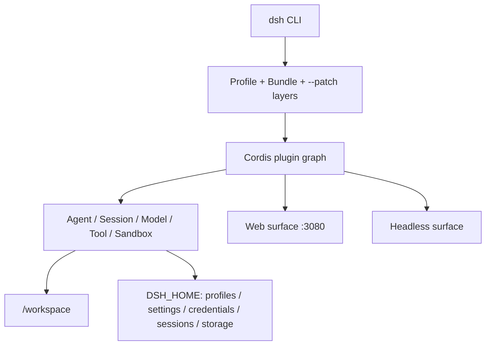

# DeepSeek Harness Docker

[English](README.en.md) | 简体中文

[](https://github.com/deepseek-ai/deepseek-harness/releases)
[](https://github.com/runzhliu/deepseek-harness-docker/releases)
[](https://hub.docker.com/r/runzhliu/deepseek-harness)
[](https://github.com/users/runzhliu/packages/container/package/deepseek-harness)
[](https://skillhub.cloud.tencent.com/skills/deepseek-harness-docker)
[](https://nodejs.org/)
[](LICENSE)

这是一个可直接构建的 DeepSeek Harness 社区容器方案，默认运行官方 `@deepseek-ai/dsh` 的 Web UI。它不构建或修改 DeepSeek Harness 源码，只把官方 npm 发行物装入一个精简、非 root 的 Node.js 24 运行时。

> 当前基线：`@deepseek-ai/dsh@0.1.2-rc.1`。DeepSeek Harness 仍处于预发布阶段；升级前应重新完成本文的构建和 Smoke Test。

`0.1.2-rc.1` 直接对应官方 [`dsh-v0.1.2-rc.1`](https://github.com/deepseek-ai/deepseek-harness/releases/tag/dsh-v0.1.2-rc.1) Release 与 npm Registry 的 [`@deepseek-ai/dsh@0.1.2-rc.1`](https://www.npmjs.com/package/@deepseek-ai/dsh/v/0.1.2-rc.1)，并非本项目自定义版本。本项目封装 npm 成品而不从源码构建，因此以可安装的官方发行物为基线，并故意不发布漂移的 Docker `latest` 标签。

> 上游版本跟踪：每日运行的 [Upstream DSH version watch](.github/workflows/upstream-dsh.yml) 会同时检查 GitHub Release 与 npm。若新版 Release 已发布但 npm 制品尚不可用，工作流会创建或刷新等待 Issue 并保留当前可安装基线；同版本 npm 包可安装后，Issue 会自动切换为升级提醒，固定版本追平后再自动关闭。

📖 延伸阅读：[DeepSeek Harness GitHub 仓库深度解析](https://aik8s.run/ai-k8s/rag-agent/deepseek-harness-repository-analysis/) · [Docker、Compose 与 Helm 部署实战](https://aik8s.run/ai-k8s/rag-agent/deepseek-harness-runtime-containerization/)

🤖 **Agent Skill：**根目录的 [`SKILL.md`](SKILL.md) 已作为 [`deepseek-harness-docker`](https://skillhub.cloud.tencent.com/skills/deepseek-harness-docker) 发布到腾讯云 SkillHub，可供支持 Agent Skills 的客户端安装和使用。它指导 Agent 按本项目的安全边界完成 Docker Compose/Helm 部署、验证、升级与排障；这是部署辅助 Skill，不是 DSH 运行时插件。


## 项目状态

| 能力 | 状态 | 验证结果 |
| --- | --- | --- |
| Dockerfile | 可用 | `linux/arm64`、`linux/amd64` 构建与原生 PTY 实际启动均已验证 |
| Docker Compose | 可用 | Web token/cookie 认证、healthy、回环端口、重启持久化已验证 |
| Helm | 可用 | 单副本 StatefulSet、PVC、Headless Service、NetworkPolicy；`helm lint --strict` 通过 |
| Web UI | 本机单用户 | 启动 token + 签名 Cookie；无 TLS，noVNC 仍无认证，禁止直接暴露到局域网或公网 |
| Headless | 可用 | 运行时注入 provider Secret；需在目标环境验证实际模型调用和沙箱 |

## DeepSeek Harness 深入分析

本节是配套技术文章的精简版。Cordis 架构、Agent 轮次和事件溯源持久化见 [GitHub 仓库深度解析](https://aik8s.run/ai-k8s/rag-agent/deepseek-harness-repository-analysis/)；镜像设计、安全模型和容器验证矩阵见 [Docker、Compose 与 Helm 部署实战](https://aik8s.run/ai-k8s/rag-agent/deepseek-harness-runtime-containerization/)。

### 它是什么，不是什么

[DeepSeek Harness](https://github.com/deepseek-ai/deepseek-harness) 不是 DeepSeek 模型权重或推理引擎，而是一套 TypeScript AI Agent Runtime。它把模型适配、会话、工具、权限、工作区、插件、Web UI 与 Headless 入口装配在一起，最终发布为 [`@deepseek-ai/dsh`](https://www.npmjs.com/package/@deepseek-ai/dsh) CLI。更合适的专题归类是“AI Agent Runtime 的云原生化”，而不是“LLM 推理部署”。

截至 2026-08-13，上游仓库还没有 Dockerfile、Compose 或 Kubernetes 清单；同时 [`CONTRIBUTING.md`](https://github.com/deepseek-ai/deepseek-harness/blob/master/CONTRIBUTING.md) 明确表示暂不接受外部 Pull Request，并鼓励社区创建生态项目和教程。因此本项目采用独立社区实现，而不冒充官方镜像。

### 运行时分层



1. **CLI 与 Profile。** `dsh web` 是 Web profile 的快捷入口，`dsh --profile headless` 则走一次性或自动化场景。Profile 不是一份封闭配置，而是基础 bundle、界面 bundle、用户 patch 和命令行 `--patch` 按顺序叠加的结果。
2. **Cordis 组合层。** Harness 通过 Cordis Loader 把模型、会话、工具、Web Server、目录选择器等能力装成插件图；依赖注入决定激活顺序，配置 patch 通过稳定 `id` 覆盖目标行。本项目没有 fork 源码，而是复用这条官方扩展缝隙覆盖容器监听地址。
3. **Agent 核心。** 模型路由、系统提示词、会话持久化、工具调用、目标/计划、子 Agent 与工作区都在 Host 侧组合。Web 只是浏览器客户端，不是另一个 Agent 实现。
4. **Surface。** Web surface 提供浏览器交互，Headless surface 适合 CLI、CI 和批处理。二者共享核心插件与 `$DSH_HOME` 数据模型。

### 数据与持久化边界

`DSH_HOME` 是容器化的关键边界。本项目显式设为 `/home/node/.dsh`，其中会出现：

- `profiles/`：profile 的包清单、Cordis 配置和用户 patch；
- `settings.yaml` 与凭据文件：模型设置及 Secret 引用/托管凭据；
- `sessions/`：会话日志；
- `storages/`：Workspace 等领域状态。

工作代码位于 `/workspace`，与内部状态卷分离。Compose 使用 `dsh-home` 命名卷加工作区 bind mount；Helm 使用 `dsh-home` PVC，并允许通过 `workspace.existingClaim` 挂载另一块工作区 PVC。这个分离让镜像可以重建，而会话与配置不会随容器消失。

### 为什么容器化并不只是 `npx`

| 难点 | 上游行为 | 本项目决策 |
| --- | --- | --- |
| Node / glibc | 要求 Node 22.19+ 或 24+；部分用户二进制需要较新 glibc | 固定官方 `node:24-trixie` 非 slim，Debian 13 / glibc 2.41 |
| 原生依赖与 Agent 工具 | `node-pty` 或第三方插件可能需要本机构建；Agent 需要常见开发命令 | 多阶段安装 DSH；runtime 有意保留 buildpack-deps 工具链，并补齐 `jq`、`less`、`ripgrep`、`rsync`、`zip` 等命令 |
| Web 监听 | CLI 主动拒绝 `--host 0.0.0.0` | 使用 Cordis overlay；宿主端口只能绑定 `127.0.0.1` |
| Web 安全 | 有启动 token 认证与 Host/Origin 检查，但无 TLS；noVNC 无认证，工具可触发代码执行 | 不提供 Ingress/LoadBalancer；Compose 回环发布；Helm 默认拒绝 Pod 入站 |
| HMR | 启动后挂载配置 watcher，需要 Node internals | 仅给 DSH 主进程传 `--expose-internals`，不通过 `NODE_OPTIONS` 传播给 Agent 子进程 |
| 目录选择器 | 浏览模式以 `os.homedir()` 为首页 | 将 `HOME` 指向可写 `/workspace`，避免只读 `/home/node` 的 EROFS |
| 信号和子进程 | Agent 会创建 shell/PTY 子进程 | 使用 `tini` 转发信号和回收孤儿进程 |
| 权限 | 工具需要工作区写入，但不应获得宿主权限 | UID 1000、只读根文件系统、drop ALL、no-new-privileges、最小挂载 |

默认基础镜像选择非 slim 是面向 coding agent 的明确取舍，而不是追求最小体积。Debian 13 Trixie 将 glibc 从 Bookworm 的 2.36 提升到 2.41，能运行更多按新系统构建的二进制；官方 Node 非 slim 变体基于 `buildpack-deps`，自带编译器、`make`、`git`、`curl`、`file`、`unzip`、`wget`、`xz` 等开发工具，本项目再显式安装 `jq`、`less`、`ripgrep`、`rsync` 和 `zip`。代价是基础镜像压缩体积比 slim 大约增加 330 MB；Smoke Test 会同时检查 Trixie、glibc 2.41 和完整命令清单，避免后续升级意外退化。

这里最需要强调的是 Web 监听：Docker bridge 端口转发要求容器进程监听非 loopback 地址，但 Harness 的 CLI 会拒绝 `--host 0.0.0.0`，防止具备代码执行能力的 Web surface 被误暴露。本项目只在容器内部用官方 patch 机制改监听地址，并把安全责任收回到部署边界：Compose 只发布 `127.0.0.1`，Kubernetes 只建议 `kubectl port-forward`。DSH `0.1.2` alpha 系列已加入启动 token、签名 Cookie 与 Host/Origin 检查，但仍没有 TLS，内置 noVNC 也没有认证；如果改成 `-p 3080:3080`、NodePort、LoadBalancer 或公开 Ingress，仍会破坏这个安全模型。

### 容器与 Harness 沙箱的关系

容器不是 Harness 内部权限系统的替代品，两层保护的对象不同：

- Docker/Kubernetes 限制进程能看到哪些宿主目录、Linux capabilities 和资源；
- Harness 沙箱限制 Agent 工具在已进入容器的文件系统中能够执行什么。

Linux Landlock、用户命名空间和原生 helper 的可用性会受宿主内核与容器运行时影响。本项目不会用 `--privileged`、Docker socket 或额外 capabilities 掩盖沙箱失败。发布前除“页面能打开”外，还必须在目标平台验证一次真实 bash/文件工具调用。

### 为什么 Kubernetes 使用 StatefulSet

Harness 的 profile、模型设置、凭据、会话和 Workspace 索引都具有状态。单用户 Web 又不适合在没有会话协调的情况下横向扩容。因此 Helm Chart 固定一个 StatefulSet 副本：稳定地挂载 `dsh-home` PVC，升级时保留状态，卸载时保留 PVC，并明确拒绝把“加 replicas”伪装成高可用。未来只有在上游提供外部身份、多租户隔离和共享/并发安全的状态后端后，才适合讨论多副本服务化。

## 为什么不只是写 `FROM node` + `npx`

这个镜像处理了最容易漏掉的四个容器边界：

- 固定 DSH 版本，并在构建时校验实际 CLI 版本；
- 固定 pnpm 版本，使 `dsh plugin add` 能在运行时管理社区插件；
- 使用非 root 用户和 `tini`，正确处理 Agent 启动的子进程与退出信号；
- 把配置、凭据、会话和存储统一持久化到 `/home/node/.dsh`；
- 把容器用户的交互主目录指向 `/workspace`，让 Web 目录选择器的新建操作落在可写工作区；
- 通过容器专用 Cordis overlay 监听容器网络，同时只把宿主端口发布到 `127.0.0.1`。

DeepSeek Harness Web 会用启动 token 换取签名浏览器 Cookie，并检查 Host/Origin；但它仍没有 TLS，Web API 可以执行代码，本镜像的 noVNC 端口也没有认证。因此本方案是**本机单用户开发环境**，不是可直接暴露到局域网或公网的服务。

## 快速开始

在本目录执行：

```bash
docker compose pull
DSH_WORKSPACE=/absolute/path/to/your/project docker compose up -d --no-build
docker compose ps
docker compose logs --no-color deepseek-harness | grep 'dsh web:'
```

打开日志中 `dsh web:` 后面带 `?token=...` 的完整 <http://127.0.0.1:3080> 地址。Harness 会把当前进程的启动 token 换成签名 Cookie，再跳转到干净的根路径；直接打开不带 token 的根地址会返回 `401`。进入后在设置页配置模型和凭据。侧边栏的“浏览器”按钮会在 Harness WebUI 内直接打开可交互的容器 Chromium；配置和浏览器 Profile 写入命名卷 `dsh-home`，重建容器后仍会保留。

未设置 `DSH_WORKSPACE` 时，Compose 使用独立的 `dsh-workspace` 命名卷，避免 Agent 意外修改本仓库。只有准备好明确的项目目录后，才通过 `DSH_WORKSPACE=/absolute/path/to/project` 改用 bind mount。

默认镜像修订版为 Docker Hub 上的 [`runzhliu/deepseek-harness:0.1.2-rc.1-r1`](https://hub.docker.com/r/runzhliu/deepseek-harness)，同一份多架构制品也会发布到 GitHub Container Registry：[`ghcr.io/runzhliu/deepseek-harness:0.1.2-rc.1-r1`](https://github.com/users/runzhliu/packages/container/package/deepseek-harness)。`r1` 是容器修订号，镜像内固定的上游 DSH 仍为 `0.1.2-rc.1`。Compose 同时保留 `build` 配置，方便审查并从本目录复现镜像；如需本地构建，执行 `docker compose build --pull` 后再启动。

需要从 GHCR 拉取时，设置镜像仓库即可，其他 Compose 配置保持不变：

```bash
DSH_IMAGE_REPOSITORY=ghcr.io/runzhliu/deepseek-harness docker compose pull
DSH_IMAGE_REPOSITORY=ghcr.io/runzhliu/deepseek-harness \
  DSH_WORKSPACE=/absolute/path/to/your/project docker compose up -d --no-build
```

### WebUI 内置浏览器

镜像内置 Debian Chromium、中文字体、Xvfb/Openbox 桌面和 noVNC。公开插件 `@runzhliu/dsh-browser-desktop` 通过 Harness 的 `sidebar.footer.action` 与 `shell.overlay` 扩展点提供始终可见的“打开浏览器”入口，点击后直接在 WebUI 内嵌可交互桌面，也可以选择新窗口打开 <http://127.0.0.1:6080/vnc.html?autoconnect=1>。内嵌面板默认占页面约 68%，可拖动标题栏移动、拖动右下角缩放，并支持最大化/还原。插件同时注册 `browser_open` Agent 工具；在对话中说“用浏览器打开 https://example.com”会创建并激活 Chromium 标签页，然后自动展开内嵌面板。浏览器意外退出或关闭后会自动重启，Profile 持久化到 `/home/node/.dsh/chrome-profile`。


_实际运行效果：浏览器浮窗位于 Harness WebUI 内，图中打开的是 DeepSeek Harness 的公开 GitHub 仓库。_

该实现参考了 [`docker-antigravity`](https://github.com/runzhliu/docker-antigravity) 的可视桌面思路，但没有采用其 `amd64` 基础镜像和 Selkies，而是使用 Debian 原生架构软件包，因此 Apple Silicon 与 x86 Linux 均可运行。6080 与 3080 一样只绑定宿主机回环地址；noVNC 当前没有认证，不能暴露到局域网或公网。

```bash
docker compose exec deepseek-harness chromium-docker --version
docker compose exec deepseek-harness \
  chromium-docker --headless=new --dump-dom https://example.com
```

Compose 为 Chromium 配置了 1GB `/dev/shm`。启动器只对浏览器进程附加 `--no-sandbox`，以适配容器现有的 `cap_drop: ALL` 和 `no-new-privileges` 策略，不会放宽整个容器的权限。Agent 与脚本仍可通过 `chromium-docker --headless=new` 做无头渲染。

### 独立安装浏览器插件

插件已经按 DSH bundle 规范拆到 [`plugins/dsh-browser-desktop`](plugins/dsh-browser-desktop/README.md)，可独立打包：

```bash
npm pack ./plugins/dsh-browser-desktop --pack-destination /tmp
dsh plugin --profile web add /tmp/runzhliu-dsh-browser-desktop-0.1.2.tgz
```

`0.1.2` 插件适配 DSH `0.1.2-alpha.3` 引入的 client module system；旧 DSH `0.1.0`/`0.1.1` RC 应继续使用插件 `0.1.1`。发布到 npm 后可直接执行 `dsh plugin --profile web add @runzhliu/dsh-browser-desktop`。该 npm 包只负责 Harness Host/WebUI 集成，不会自行安装 Chromium、Xvfb 或 noVNC；本仓库 Docker 镜像是完整的参考运行时。官方 DSH 通过 npm/GitHub 和 `dsh-plugin` GitHub topic 发现社区插件。

### 可选的社区插件市场

默认镜像、默认 Compose 和 Helm Chart **不包含也不加载插件市场**，它们只跟随官方 `@deepseek-ai/dsh` 发行物。需要图形化浏览和安装社区插件时，可以显式选择独立的 [`dshmarket`](https://github.com/dsh-market/dsh-market) 变体：

```bash
docker compose -f compose.yaml -f compose.market.yaml pull
DSH_WORKSPACE=/absolute/path/to/your/project \
  docker compose -f compose.yaml -f compose.market.yaml up -d --no-build
```

该变体使用明确区分的 `runzhliu/deepseek-harness:0.1.2-rc.1-r1-market.1` 标签，固定 `dshmarket@1.38.1`，不会替换默认 DSH 标签或 `latest`。它属于社区可选集成，不是 DeepSeek 官方组件，也不代表本项目对市场条目的审核或背书。

市场自身在构建期固定并打入可选镜像；通过市场安装的插件和 pnpm store 会写入持久化的 `dsh-home` 卷。安装过程需要容器能够访问 npm/GitHub，第三方包的构建脚本仍应在审查后单独授权。市场内的一键重启已禁用，变更需要通过 `docker compose restart` 或 Kubernetes rollout 进入新进程。

本地验证可选变体：

```bash
make market-build
make market-smoke
```

Helm 仍默认官方 DSH 镜像；只有明确设置 `--set image.tag=0.1.2-rc.1-r1-market.1` 时才使用市场变体。

如果复用的 `dsh-home` 曾被另一个 pnpm 主版本处理，安装时可能看到 `ERR_PNPM_UNEXPECTED_STORE`。先停止 DSH，再显式执行一次迁移：

```bash
docker compose -f compose.yaml -f compose.market.yaml stop deepseek-harness
docker compose -f compose.yaml -f compose.market.yaml run --rm --no-deps \
  --entrypoint dsh-market-repair-store deepseek-harness
docker compose -f compose.yaml -f compose.market.yaml up -d --no-build
```

迁移只按现有 `package.json` 重新链接依赖，固定使用 `/home/node/.dsh/pnpm-store`，并传入 `--ignore-scripts`。旧的 `node_modules` 会保留在 `/home/node/.dsh/backups/pnpm-store-*`，确认插件正常后再自行清理。

可选镜像启动时还会检查已有的 `profiles/web/cordis.patch.yml`：如果它是普通文件但因旧 UID 不可写，入口脚本会用内容完全相同、归当前运行用户所有的副本替换它，从而恢复插件开关；不会递归修改整个卷，符号链接或非普通文件只会给出警告。

本公开分支不打包任何公司内部模型、凭据、Skill 或个人工作区挂载。模型在 Harness 设置页配置；额外凭据和私有扩展应放在运行时 Secret、被忽略的 `.env` 或本机 `compose.local.yaml` 中。

查看日志和停止服务：

```bash
docker compose logs -f deepseek-harness
docker compose down
```

`docker compose down` 不删除命名卷。只有明确执行 `docker compose down --volumes` 才会删除持久化的配置、凭据、会话，以及默认 `dsh-workspace` 卷中的全部工作区数据；使用该参数前必须先备份需要保留的内容。

## 直接使用 Docker

构建镜像：

```bash
docker build -t runzhliu/deepseek-harness:0.1.2-rc.1-r1 .
```

启动 Web UI：

```bash
docker volume create dsh-home
docker run --rm \
  --name deepseek-harness \
  --publish 127.0.0.1:3080:3080 \
  --publish 127.0.0.1:6080:6080 \
  --shm-size 1g \
  --mount type=volume,src=dsh-home,dst=/home/node/.dsh \
  --mount type=bind,src="$PWD",dst=/workspace \
  runzhliu/deepseek-harness:0.1.2-rc.1-r1
```

启动命令会直接打印带 token 的访问地址，请打开该完整地址。不要把端口参数改成 `-p 3080:3080`，也不要把它部署到公开 Ingress；Web 没有 TLS，6080 上的 noVNC 也没有认证。

## Headless 模式

镜像的入口等价于执行 `dsh`，因此可以用运行参数覆盖默认 Web 命令：

```bash
docker run --rm \
  --env DEEPSEEK_API_KEY \
  --mount type=volume,src=dsh-home,dst=/home/node/.dsh \
  --mount type=bind,src="$PWD",dst=/workspace \
  runzhliu/deepseek-harness:0.1.2-rc.1-r1 \
  --profile headless "summarize this repository"
```

API Key 只应在运行时通过环境变量、Secret 或 Web 设置传入，不能写进 Dockerfile、镜像层或构建参数。

## Kubernetes / Helm

`charts/deepseek-harness` 使用单副本 StatefulSet。`/home/node/.dsh` 由 PVC 持久化，工作区可以使用独立的现有 PVC；Chart 不创建 Ingress 或 LoadBalancer，并默认创建拒绝 Pod 入站流量的 NetworkPolicy。

默认使用已发布的 Docker Hub 镜像，直接安装 Chart：

```bash
helm upgrade --install deepseek-harness charts/deepseek-harness \
  --namespace deepseek-harness \
  --create-namespace \
  --set image.repository=runzhliu/deepseek-harness \
  --set image.tag=0.1.2-rc.1-r1
```

本机开发集群也可以直接拉取默认的 `runzhliu/deepseek-harness`，或先用 `kind load docker-image` / `minikube image load` 导入同名本地镜像。

通过 API Server 安全转发到本机浏览器：

```bash
kubectl -n deepseek-harness rollout status statefulset/deepseek-harness
kubectl -n deepseek-harness port-forward service/deepseek-harness 3080:3080 6080:6080
```

另开终端执行 `kubectl -n deepseek-harness logs statefulset/deepseek-harness | grep 'dsh web:'`，然后打开日志中带 token 的完整 <http://127.0.0.1:3080> 地址；内嵌桌面通过同一条命令转发到 <http://127.0.0.1:6080>。不要把无 TLS 的 Web surface 或无认证的 noVNC 改成 NodePort、LoadBalancer 或直接接入 Ingress。

如需通过 Secret 注入 provider 环境变量：

```bash
kubectl -n deepseek-harness create secret generic dsh-provider-credentials \
  --from-literal=DEEPSEEK_API_KEY='replace-me'

helm upgrade deepseek-harness charts/deepseek-harness \
  --namespace deepseek-harness \
  --reuse-values \
  --set credentials.existingSecret=dsh-provider-credentials
```

如需持久化工作区，先创建 PVC，再设置 `workspace.existingClaim`。未设置时 `/workspace` 是临时 `emptyDir`。卸载 Chart 后，StatefulSet 创建的 `dsh-home` PVC 默认保留；确认不再需要配置、凭据和会话后再手动删除。

```bash
helm uninstall deepseek-harness --namespace deepseek-harness
kubectl -n deepseek-harness get pvc
```

## 升级版本

构建参数控制安装的 DSH 版本：

```bash
docker build \
  --build-arg DSH_VERSION=0.1.2-rc.1 \
  --build-arg IMAGE_VERSION=0.1.2-rc.1-r1 \
  -t runzhliu/deepseek-harness:0.1.2-rc.1-r1 .
```

Compose 分别使用上游版本和不可变镜像修订版：

```bash
DSH_VERSION=0.1.2-rc.1 DSH_IMAGE_VERSION=0.1.2-rc.1-r1 docker compose build --pull
```

维护者可用 `make push` 构建并推送同一个不可变修订标签下的 `linux/amd64` 与 `linux/arm64` manifest。目标标签已经存在时命令会拒绝覆盖，也不会创建 `latest` 标签。

可选市场变体使用独立的 `make market-push`，只发布带 `-market.1` 后缀的双架构标签，不改变默认镜像。

[Mirror Docker Hub images to GHCR](.github/workflows/publish-ghcr.yml) 工作流使用现有 Docker Hub manifest 创建 GHCR 碳拷贝，不重新构建镜像。发布以 `image-v` 开头的 GitHub Release 时会同步基础标签；维护者也可手动指定版本，并选择同时同步 `-market.1` 变体。同步后会比较源和目标的全部平台 manifest digest，且不会创建 `latest`。

不要默认安装 `latest`。RC 版本正在快速变化，固定版本才能让问题可复现。

## 安全边界

- 容器默认以镜像内的 `node` 用户（UID/GID 1000）运行；如果宿主工作区拒绝该 UID 写入，需要调整目录权限或构建适配本机 UID 的派生镜像。
- Web 目录选择器中的“主目录”是 `/workspace`，不是保存内部配置的 `/home/node`；通过 Compose 或 Kubernetes 挂载的工作区必须可由 UID 1000 写入。
- Compose 丢弃全部 Linux capabilities、启用 `no-new-privileges`、只读根文件系统，并给 `/tmp` 单独的 tmpfs。
- 只挂载需要 Agent 操作的工作区。不要挂载宿主根目录、`~/.ssh`、云凭据目录或 Docker socket。
- Docker 隔离不是多租户安全沙箱。不要把这个实例交给不受信任用户，也不要把未审查的插件装进持久化配置卷。
- DeepSeek Harness 自己的 Linux 沙箱能力受宿主内核和容器运行时影响；镜像不会通过 `--privileged` 或额外 capabilities 绕过失败。应保留其默认权限模式，并验证真实工具调用。

## Smoke Test

每次升级至少完成以下检查：

```bash
docker run --rm --entrypoint dsh runzhliu/deepseek-harness:0.1.2-rc.1-r1 --version

docker run --rm --entrypoint dsh runzhliu/deepseek-harness:0.1.2-rc.1-r1 \
  web --patch /opt/deepseek-harness/web.cordis.patch.yml --dump-config

docker compose up -d
test "$(curl --silent --output /dev/null --write-out '%{http_code}' http://127.0.0.1:3080/)" = 401
make smoke
docker compose ps
docker compose logs --no-color deepseek-harness
```

通过标准包括：CLI 版本等于构建版本；dump 后的 `webserver.config.host` 为 `0.0.0.0`；未认证首页返回 `401`，启动 token 能换取 Cookie 并加载首页；容器进入 healthy；日志没有配置或插件加载错误；容器不会尝试调用宿主默认浏览器。真正发布镜像前还要分别在 `linux/amd64` 和 `linux/arm64` 上构建并实际 spawn PTY，因为终端与沙箱相关依赖包含原生模块。仓库提供 `make verify`、`make build` 和 `make smoke` 作为默认入口；可选市场另用 `make market-build` 和 `make market-smoke`，并额外验证默认镜像中不存在市场包。

## 常见问题

如果 Web 新建文件夹时报 `EROFS: read-only file system, mkdir '/home/node/...'`，说明容器仍在运行早期镜像或旧容器。当前镜像把目录选择器的主目录设为 `/workspace`。重新构建并强制重建容器：

```bash
docker compose build
docker compose up -d --force-recreate
docker compose exec deepseek-harness node -e "console.log(require('node:os').homedir())"
```

最后一条命令应输出 `/workspace`。如果错误变成 `/workspace` 下的 `EACCES`，则是宿主 bind mount 与容器 UID 1000 的权限不匹配；修正工作区所有权/权限，或构建使用匹配 UID 的派生镜像，不要改成 root 运行。

## 文件

| 文件 | 用途 |
| --- | --- |
| `Dockerfile` | 固定版本的非 root DSH 运行时，默认启动 Web UI |
| `Dockerfile.market` | 从默认镜像派生、固定第三方市场版本的可选镜像 |
| `web.cordis.patch.yml` | 只用于 Docker bridge 网络的 Web 监听覆盖 |
| `compose.yaml` | 持久化、回环端口和收紧后的运行时配置 |
| `compose.market.yaml` | 显式选择第三方社区市场镜像的可选 Compose overlay |
| `web.market.cordis.patch.yml` | 只由可选市场派生镜像使用的 profile 配置 |
| `plugins/dsh-browser-desktop/` | 可独立发布的 DSH 浏览器桌面 bundle |
| `charts/deepseek-harness/` | 单副本 StatefulSet、PVC、Service 和 NetworkPolicy |
| `scripts/smoke.sh` | CLI、配置、原生 PTY 和 HTTP 启动验证 |
| `.github/workflows/ci.yml` | Compose/Helm 校验和双架构镜像 Smoke Test |
| `.dockerignore` | 把构建上下文限制到镜像真正需要的文件 |

本目录是社区实现，不代表 DeepSeek 官方发布的容器镜像。
