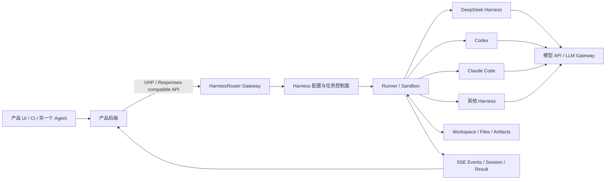

# HarnessRouter 综述：从模型路由到 Agent Harness 基础设施

> 更新日期：2026-09-13  
> 本文讨论的是 [HarnessRouter](https://harnessrouter.ai/) 及其 Unified Harness Protocol（UHP），不是 Harness.io 的 CI/CD 产品，也不是同名的本地账号切换 CLI。

## 摘要

HarnessRouter 是一个面向 **Agent Harness** 的统一执行接口。它试图让产品后端通过同一套 API 运行 Codex、Claude Code、DeepSeek Harness、Gemini CLI、Hermes、OpenCode、Pi、Qwen Code 等完整 Agent Runtime，而不用分别处理每个 CLI 的进程、会话、流式事件、文件、取消、失败恢复和沙箱。

它不是普通的 LLM API 中转器：

- LLM Gateway 处理的是一次模型调用，即“messages in, tokens out”；
- HarnessRouter 处理的是一项可能持续几分钟甚至更久的任务，即“task in, events/files/artifacts out”；
- 模型路由发生在 Agent 下面，Harness 路由发生在 Agent Runtime 这一层；
- 两者可以叠加，并不是替代关系。

截至 2026-09-13，HarnessRouter 提供托管 Cloud 和 Apache-2.0 的 Community Edition。官方网站列出了 41 个经过资料审阅的 Harness，其中 10 个标记为可运行；DeepSeek Harness 的运行 ID 是 `dsh`。其统一协议 UHP 当前版本为 `2026-09-12`，仍明确标注为 Draft Standard。

我的判断是：**这个方向有价值，产品形态也已经可试用，但协议、生态和产品都很新。** 如果只是给本地 DSH 换模型地址，没有必要增加这一层；如果要把多个 Coding Agent 作为产品后端、批量运行隔离任务，或者系统化比较“Harness × Model”组合，它才真正解决问题。

## 1. 先把几个相似名字分开

| 名称 | 路由对象 | 主要用途 |
| --- | --- | --- |
| [HarnessRouter](https://harnessrouter.ai/) | 完整 Agent Harness 与任务生命周期 | 把多种 Coding Agent 接到同一产品 API 后面 |
| [Unified Harness Protocol](https://unifiedharnessprotocol.org/) | Client、Server 与 Harness 之间的协议 | 规范 Harness 发现、任务、事件、会话、文件、取消和错误 |
| [Agent Router](https://theagentrouter.ai/docs/) | 模型和 MCP 流量 | 鉴权、协议转换、配额、负载均衡和故障转移，前身是 Envoy AI Gateway |
| [LLM API 中转器](llm-api-relay-gateway-overview.md) | 模型请求 | 统一 OpenAI/Anthropic 等模型 API、Key、计费和路由 |
| [joshuaboys/harness-router](https://github.com/joshuaboys/harness-router) | 本地 CLI 账号/Profile | Rust 命令行工具 `hr`，切换 Claude Code、Codex 等账号；没有代理、服务端或任务 API |
| DSH Model Router 插件 | DSH 内部的模型/子 Agent | 在同一个 DeepSeek Harness 内按角色、难度或故障状态换模型 |

最后一类尤其容易混淆。DSH 的 Model Router 插件决定“这一轮用哪个模型”或“子 Agent 用哪个模型”；HarnessRouter 决定“产品通过哪个完整 Harness 执行这项任务”，并统一其外围生命周期。

## 2. 为什么需要 Harness 层

模型本身只生成 token。一个能真正修改代码、分析文件或交付制品的 Agent，通常还需要：

- 计划、调用工具、观察结果、继续推理的循环；
- 系统提示词、上下文裁剪、压缩和持久会话；
- Shell、Git、文件系统、浏览器、MCP 与 Skill；
- 权限确认、网络和文件边界、超时与预算；
- 工作区、沙箱、进程管理与中断恢复；
- 流式过程事件、最终文本、文件和可预览制品。

这些能力组合起来才是 Harness。Codex、Claude Code 和 DeepSeek Harness 即使调用同一个模型，在提示构造、工具定义、Agent Loop、上下文管理和失败处理上也不同，因此结果、速度和 token 消耗都可能不同。

如果一个产品要支持 `N` 个 Harness，每个 Harness 都要分别适配 `M` 项生命周期能力，工程量会接近 `N × M`。HarnessRouter 的核心主张就是把这一组适配收敛成一个稳定的产品接口。

## 3. 整体架构



一项任务大致经历以下过程：

1. 产品后端选择一个已经配置好的 Harness，并提交任务和允许访问的文件。
2. Gateway 创建 Response/Session，校验身份、作用域、幂等键与参数。
3. Runner 准备工作区和执行环境，启动目标 Harness。
4. Harness 自己运行 Agent Loop、调用模型、读写文件并执行工具。
5. HarnessRouter 把各 Harness 的原生输出转换成统一的 SSE 事件。
6. 任务完成后，产品得到状态、文本、文件、Artifact 与可继续的 Session ID。
7. 后续请求通过 `previous_response_id` 继续同一会话，或者显式取消仍在运行的任务。

这里最关键的边界是：HarnessRouter **不重新实现每个 Harness 的 Agent Loop**，而是以 Adapter 驱动真正的 Harness，再把差异规范化。

## 4. UHP：它真正想建立的护城河

[Unified Harness Protocol](https://unifiedharnessprotocol.org/) 是 HarnessRouter 提出的开放 HTTP 协议。它定义三个角色：

- **Client**：需要完成工作的产品后端、CLI、CI 或另一个 Agent；
- **Server**：接收任务、驱动 Harness 并返回统一事件的实现；
- **Harness**：拥有自己的 Agent Loop、工具和会话状态的完整 Runtime。

UHP 当前覆盖：

| 范围 | 解决的问题 |
| --- | --- |
| Discovery 与 Version | 服务支持哪个 UHP 版本、哪些能力和 Harness |
| Harness Configuration | 默认模型、系统提示、工具限制、Skill、MCP、步数和时间预算 |
| Tasks | 如何提交一项工作并获得标准 Response |
| Streaming | 如何用 SSE 表达文本、工具调用、文件和终态 |
| Sessions | 如何继续对话、检查历史和取消运行中的工作 |
| Files 与 Artifacts | 如何上传输入文件、列出并下载 Agent 交付物 |
| Errors 与 Idempotency | 可机读错误、重试语义和避免重复启动任务 |
| Security | 身份作用域、对象不可枚举、凭据和文件边界 |
| Schema 与 Conformance | OpenAPI 3.1、JSON Schema 和可运行的一致性测试 |

UHP 的任务接口刻意兼容 OpenAI Responses API 的一个子集，再通过 `metadata.harness_id`、Session、File 等附加对象表达 Harness 语义。这使已有 Responses SDK、SSE Parser 和 UI 组件更容易复用。

但“开放协议”需要加两个限定词：

1. 它确实以 Apache-2.0 发布，包含规范、Schema、参考实现和 Conformance Suite，也不强制连接 HarnessRouter Cloud。
2. 它目前仍是由 HarnessRouter 在自己的仓库中主导维护的 Draft Standard，治理是 maintainer-led；生态是否会出现多个真正独立且互通的实现，还需要时间验证。

所以，UHP 现在可以作为一个设计良好的开放契约来评估，但还不能按 HTTP、OCI 或 Kubernetes API 那样的成熟行业标准来假设。

## 5. “Router”目前究竟会不会自动路由

名字容易让人以为它会自动分析任务，然后在 Codex、Claude Code 和 DSH 之间选出最优者。至少从当前公开 API 看，核心路径仍然是：

- 先创建或选择一个 Configured Harness；
- 请求通过 `metadata.harness_id` 指定它；
- `model` 同样由配置或请求指定；
- 产品可以在自己的服务端维护 `feature_key → harness_id` 映射；
- 通过 Trace 和自有评测比较不同组合，再更新映射或实现策略路由。

换句话说，HarnessRouter 已经提供了“可路由的统一数据面”和比较所需的控制面，但**自动决策策略仍主要由上层产品定义**。这并不是缺陷，反而避免一个黑盒路由器在不理解业务验收标准时擅自换 Harness；只是选型时不应把“统一选择接口”误读为“开箱即用的智能路由算法”。

## 6. 当前支持范围

截至本文日期，官方 Catalog 标记下列 10 个 Harness 为 Available：

| Harness | ID | 简要定位 |
| --- | --- | --- |
| Claude Code | `claude-code` | Anthropic Coding Agent |
| Cline | `cline` | IDE 型开源 Coding Agent |
| Codex | `codex` | OpenAI Coding Agent |
| DeepSeek Harness | `dsh` | DeepSeek 可扩展 Agent Harness，当前仍是 Developer Preview |
| Gemini CLI | `gemini` | Google 开源终端 Agent |
| Hermes Agent | `hermes` | 带记忆、工具、浏览器与子 Agent 的通用 Agent |
| Oh My Pi | `omp` | 多模型终端 Coding Agent |
| OpenCode | `opencode` | 开源、多供应商 Coding Agent |
| Pi | `pi` | 较小、可操控的终端 Coding Agent |
| Qwen Code | `qwen` | Qwen Coding Agent |

Catalog 中的 “Reviewed” 只表示官方整理了基于公开资料的能力档案，不表示已经能通过 HarnessRouter 运行。即使标记为 Available，也不能假设功能完全等价：MCP、Skill、浏览器、图形界面、审批、子 Agent 和 Artifact 支持仍受各 Harness 本身约束。

## 7. Cloud 与 Community Edition

| 维度 | HarnessRouter Cloud | Community Edition |
| --- | --- | --- |
| 部署 | 官方托管 | 自建单个 Docker 部署 |
| 核心组件 | 托管 Gateway、Runner、控制面 | Console、Gateway、Runner 合在一个容器中 |
| 执行隔离 | 官方描述为 serverless、isolated sandbox | 每个 Session 分工作区和操作系统用户，并非每 Session 一个容器 |
| Provider Key | 可用平台 Key 或 BYOK | 自己提供 Key |
| 状态与文件 | 托管 Workspace | `/data` 卷保存数据库、Secret、Session、文件和工作区 |
| 运维 | 平台负责扩缩容、升级与恢复 | 用户负责备份、升级、TLS、资源和故障处理 |
| 协议 | UHP | 相同 UHP API Surface |
| 许可证 | 商业服务条款 | 核心 Community Edition 为 Apache-2.0；各 Harness CLI 仍受自己的许可证约束 |

Community Edition 的官方快速开始只需一个 Docker 容器，但这不等于它天然适合多租户生产：

- 官方要求不要给容器额外指定 `--user`，因为入口程序和 Runner 需要以容器内 root 管理每个 Session 的用户；
- 容器内 root 不等于宿主特权容器，但它与严格的 non-root Pod Security Policy 并不天然兼容；
- Rootless Podman 中的容器内 UID 0 会映射到宿主普通用户，理论上仍可工作，但用户创建、UID 映射、`chown`、文件卷和沙箱能力必须实测；
- 默认账号密码必须立即修改，对外服务还要加 TLS、网络边界、备份和监控；
- 不应把 Community Edition 的“分用户和工作区”宣传成 Cloud 的“每任务独立 Sandbox”。

## 8. 它和 LLM Gateway 如何组合

推荐把两层画成下面这样：

```text
你的产品 / CI / 自动化平台
            │
            ▼
HarnessRouter / UHP
  Harness 选择、任务、会话、事件、文件、取消、Artifact
            │
            ▼
Codex / Claude Code / DeepSeek Harness / ...
  Agent Loop、上下文、工具、Skill、MCP、权限
            │
            ▼
LiteLLM / New API / Agent Router / 企业模型网关（可选）
  模型协议、Key、配额、供应商路由、熔断、成本治理
            │
            ▼
云模型 API 或自建 vLLM / SGLang
```

| 对比项 | LLM Gateway | HarnessRouter |
| --- | --- | --- |
| 最小工作单元 | 一次 Completion/Response | 一项完整 Agent Task |
| 是否拥有 Agent Loop | 否 | 不重写，但负责启动并驱动外部 Harness |
| 状态 | 多数请求级、可附带日志 | Session、Response、事件、工作区和文件 |
| 输出 | Token、Tool Call、Usage | 过程事件、文本、文件、Artifact、终态 |
| 主要路由维度 | 模型、供应商、区域、实例 | Harness、Harness 配置、模型 |
| 失败处理 | 超时、429、5xx、首 token 前 fallback | 任务取消、失败终态、Session 继续、Artifact 恢复 |
| 典型使用者 | 模型平台团队 | 把 Agent 能力嵌入产品的应用团队 |

如果需求只是让 DSH 使用 `gd18-llm-002-qwen38-note-review` 之类的内部模型，应该直接配置 DSH 或在下面放 LLM Gateway。为了这件事单独引入 HarnessRouter，会多出一套 Session、工作区和执行控制面，却没有获得真正需要的价值。

## 9. 对 DeepSeek Harness 的实际意义

HarnessRouter 已把 DeepSeek Harness 作为 `dsh` Adapter 提供，并采用固定版本运行。它带来的价值主要有三类：

1. **产品化入口**：不直接把 DSH WebUI 暴露给最终用户，而是由自己的产品后端提交任务、接收事件和文件。
2. **横向比较**：使用相同输入与验收器，对比 `DSH × 模型 A`、`Codex × 模型 A`、`DSH × 模型 B`。
3. **迁移余地**：上层业务不直接绑定某一个 Harness 的 CLI 输出和会话格式。

它不会自动解决 DSH 本身的问题：

- 上下文窗口不足、摘要失败或模型能力不够，仍由 DSH、模型和任务拆分共同决定；
- DSH 的 Cordis 插件、WebUI、浏览器桌面等特有能力，不一定能完整映射为 UHP；
- DSH 尚处 Developer Preview，上游接口快速变化时，HarnessRouter Adapter 需要持续跟进；
- 如果需要人在 DSH WebUI 中实时批准每个工具调用，必须先验证该交互是否能被远程任务 API 正确表达。

因此，它更适合 **Headless、可验收、能以文件或结构化结果交付** 的任务，不是 DSH 桌面体验的透明远程代理。

## 10. 成本与官方 Benchmark 应该怎么读

### 10.1 Cloud 当前计费结构

截至 2026-09-13，官方页面列出的月度计划为 Free、Developer 20 美元、Production 200 美元、Scale 1,000 美元和 Enterprise 定制。计划费可抵扣当月 Usage；另外还有三个主要计量维度：

- **Model Usage**：使用平台 Key 时按 Catalog 标价计费；BYOK 时由模型供应商直接计费；
- **Agent Work**：Agent 实际执行步骤和工具的活跃时间，等待模型、用户或队列不计入；
- **Agent Memory（Beta）**：工作历史、Trajectory 与 Artifact 的 GB-hour；
- Top-up 当前有 5.5% 手续费，BYOK 模型月用量超过 25,000 美元后另有 5% Routing Fee；
- Trace 仍是 Beta，保留策略和价格随 Plan 不同。

这些都是时间敏感信息，采购前应重新查看[官方价格页](https://harnessrouter.ai/pricing)，不能把本文数字写入长期预算模型。

### 10.2 475 倍成本差不是普遍结论

HarnessRouter 公布的一项 Care Prep 测试中，8 个 Harness × Model 配置的单任务成本从 0.47 到 223 credits，相差约 475 倍；端到端时间从 1 分 25 秒到 4 分 36 秒。这个数字很醒目，但要注意：

- 这是 HarnessRouter 自己发布的供应商 Benchmark，不是独立第三方评测；
- 只有一个受控的合成数据任务，每个配置保留 5 次运行；
- 475 倍主要来自模型档位价格差，而不是 Harness 本身；
- 固定同一模型后，Harness 带来的成本差在该测试中为 1.5～2.1 倍；
- 最便宜、最快和质量最合适的配置不一定是同一个。

真正有用的结论不是“某个 Harness 永远最好”，而是 Harness 的 Agent Loop 会显著影响总成本和延迟，应该用自己的任务、自己的成功标准做配对评测。

## 11. 优点

- **降低集成重复劳动**：统一启动、事件、Session、取消、文件和错误模型。
- **保留 Harness 选择权**：产品接口不直接绑定某个 CLI 的私有输出格式。
- **更合理的评测单位**：比较完整的 Harness × Model，而不是只比较模型榜单。
- **适合异步产品体验**：长任务可以流式展示进度，并返回文件和 Artifact。
- **有自建路径**：Community Edition、UHP、Schema 与 Conformance Suite 都公开。
- **从本地到 Cloud 的 API 一致性**：可以先在自建环境验证，再决定是否托管。

## 12. 局限与风险

### 12.1 抽象不可能完全抹平 Harness 差异

某些 Harness 支持原生 Plan、审批、浏览器、子 Agent 或复杂 Skill，另一些没有。统一协议只能表达共同语义和显式 Capability，无法保证同一个任务切换 Harness 后行为等价。越依赖某个 Harness 的独占能力，迁移收益越低。

### 12.2 状态可携带不等于状态可互换

UHP 可以统一 Session 的创建、继续和查询，但 Codex 的内部上下文不能直接搬成 Claude Code 或 DSH 的原生会话。实践中更可靠的是在新 Harness 上以业务摘要、输入文件和验收条件重新开始，而不是承诺跨 Harness 无损热迁移。

### 12.3 安全面比模型代理大得多

HarnessRunner 不只看到 Prompt，还能接触源码、上传文件、工作区、Shell、Git、MCP、外部网络、生成制品和 Provider Key。一处越权的影响可能是执行命令或外传文件，而不只是泄露一次对话。

### 12.4 Cloud 和自建都有责任边界

- Cloud 需要审查 DPA、Subprocessor、处理地域、数据保留、删除和事件响应；
- 自建减少第三方数据面，但用户要承担 OS、容器、TLS、Secret、备份、升级和 Harness 供应链风险；
- Harness CLI 在首次启动时安装，并受各自许可证和更新机制约束；
- 官方 Security Policy 也明确要求把实例视为“能够用所授予凭据执行代码”的系统。

### 12.5 协议与生态仍处早期

UHP 更新很快，本文写作前一天刚发布 `2026-09-12` 版本。开放 Schema 和 Conformance Test 是好基础，但版本演进、兼容窗口、第三方实现数量、长期治理和 Adapter 维护质量仍需观察。

## 13. 上线前必须验证什么

### 功能

- 实际需要的 Harness、模型、Skill、MCP 和工具是否都被支持；
- SSE 是否持续 flush，断线重连会不会重复执行任务；
- `Idempotency-Key` 是否真正避免重复启动和重复扣费；
- Session Continue、Cancel、超时和进程残留是否符合预期；
- 文本、二进制文件、中文路径、大文件和 Artifact 下载是否可靠；
- Tool Approval 与人工介入能否被产品 UI 正确表达。

### 隔离与安全

- 不同租户是否无法枚举或下载对方的 Session/File；
- 工作区之间的 UID、目录权限、临时文件和进程是否隔离；
- Agent 可以访问哪些环境变量、Provider Key、Git Credential 和 SSH Key；
- 默认拒绝哪些出站网络，MCP Server 是否单独授权；
- 高风险 Shell、删除、发布和外部写操作是否有审批或策略门；
- 日志、Trace、Prompt、文件和 Artifact 的保留、导出与删除是否满足要求；
- Community Edition 的备份恢复是否包含数据库、Secret、工作区和加密密钥。

### 评测与成本

- 使用真实任务样本，而不是只跑 `hello world`；
- 固定输入、Skill、权限、网络和验收器，只改变 Harness/Model；
- 至少记录成功率、人工修正次数、墙钟时间、活跃工作时间、模型 token、总成本、工具失败和恢复成功率；
- 对非确定性任务重复多次，报告分布而不是单个最好成绩；
- 把“任务完成”和“制品正确”分开统计。

## 14. 面向当前 DSH 项目的建议

### 暂时不需要接入的情况

- 主要通过 DSH WebUI 做个人交互；
- 只有一个工作区、一个 Harness 和少量模型；
- 当前痛点是模型上下文、浏览器插件或容器部署；
- 没有自己的产品后端需要调用 Agent Task API。

这种情况下，继续维护本仓库的 DSH 容器，并视需要在模型层增加 LiteLLM/New API，架构更简单。

### 值得做 POC 的情况

- 准备在 `aik8s.run` 或其他产品中提供 Agent 能力，而不是直接暴露 DSH WebUI；
- 想用相同任务比较 DSH、Codex、Claude Code、Gemini CLI 和 Qwen Code；
- 需要并发运行大量隔离、可取消、可追踪的 Headless Task；
- 交付物是代码改动、文档、表格或其他可自动验收的 Artifact；
- 希望未来替换 Harness 时不重写整个后端。

建议先做一个有限 POC：

1. 准备 10～20 个真实、去敏后的任务和确定的验收器。
2. 选择 2 个 Harness、2 个模型，形成 4 组配置。
3. 每组至少重复 3～5 次，记录完整成功率、p50/p95 时延和总成本。
4. 专门注入模型 429、Runner 重启、SSE 断线、任务取消和大文件等失败。
5. 先在 Community Edition 验证 API 和数据边界，再比较 Cloud 的运维收益。
6. 只有当多 Harness 的收益大于新增控制面的复杂度时，才放入正式链路。

## 15. 结论

HarnessRouter 抓住了一个真实的新基础设施层：当 Codex、Claude Code、DeepSeek Harness 等完整 Agent 被嵌入产品后，团队需要统一的不再只是模型 API，而是任务、会话、工具、工作区、流式事件、文件、取消和失败语义。

它最贴切的类比不是“另一个 OpenRouter”，而是 **Agent Harness 层的统一 API 与执行控制面**。UHP 则试图把这个接口从单一商业产品中抽离出来。

现阶段适合的态度是：

- 认可它解决的问题；
- 用 Community Edition 和 UHP 做小规模验证；
- 对 Router 的自动化程度、Cloud 与 CE 的隔离差异保持清醒；
- 用真实任务验证 Harness × Model，而不是采用供应商排行榜；
- 不为单一 DSH 本地部署平白增加一层。

## 参考资料

- [HarnessRouter 官网](https://harnessrouter.ai/)
- [HarnessRouter Community Edition](https://github.com/HarnessRouter/harnessrouter)
- [HarnessRouter Harness Catalog](https://harnessrouter.ai/harnesses)
- [DeepSeek Harness on HarnessRouter](https://harnessrouter.ai/harnesses/deepseek-harness)
- [HarnessRouter Integration Docs](https://harnessrouter.ai/docs)
- [HarnessRouter Cloud Pricing](https://harnessrouter.ai/pricing)
- [HarnessRouter Benchmark 01](https://harnessrouter.ai/benchmarks)
- [Unified Harness Protocol](https://unifiedharnessprotocol.org/)
- [UHP Governance](https://github.com/HarnessRouter/harnessrouter/blob/main/protocol/GOVERNANCE.md)
- [HarnessRouter Security Policy](https://github.com/HarnessRouter/harnessrouter/blob/main/SECURITY.md)
- [DeepSeek Harness 官方仓库](https://github.com/deepseek-ai/deepseek-harness)
- [同名本地 CLI：joshuaboys/harness-router](https://github.com/joshuaboys/harness-router)
- [大模型 API 中转器与 LLM Gateway 综述](llm-api-relay-gateway-overview.md)
