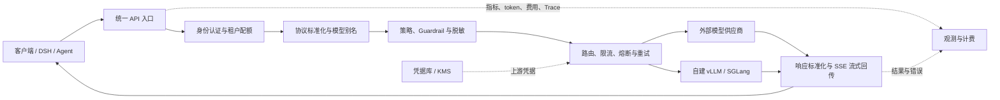

# 大模型 API 中转器与 LLM Gateway 综述

> 更新日期：2026-09-13  
> 本文中的“中转器”特指位于 AI 客户端与模型服务之间的 API Relay、LLM Proxy、AI Gateway 与推理路由层，不讨论普通网络加速器。

## 摘要

大模型 API 中转器的本质是一个理解模型协议的反向代理：客户端只连接一个地址，中转器完成身份认证、模型别名解析、协议转换、上游凭据注入、路由、重试、流式转发、用量统计和审计，再把统一格式的结果返回客户端。

“一个域名转发到另一个域名”只是最简形态。生产级 LLM Gateway 还必须理解 token、上下文窗口、SSE 流、工具调用、不同模型能力、供应商限流和计费规则。市面上的产品大致分为四类：

1. **托管聚合平台**：平台代管供应商接入与结算，例如 OpenRouter、Vercel AI Gateway。
2. **自建统一 API 与配额平台**：自己持有上游 Key，例如 LiteLLM Proxy、New API、One API。
3. **企业 AI/API Gateway**：在传统 API 网关上增加模型协议、治理与观测，例如 Kong、Apache APISIX、Higress、Agent Router（原 Envoy AI Gateway）。
4. **推理集群与语义路由器**：面向自建 vLLM/SGLang 实例、GPU 副本和模型选择，例如 AIBrix、vLLM Semantic Router。

没有一个产品在所有场景中都最好。个人快速接入、团队成本治理、企业合规和 GPU 集群调度需要的是不同类型的中转器。

## 1. 先区分几个容易混用的概念

| 名称 | 是否理解模型请求 | 主要职责 | 典型例子 |
| --- | --- | --- | --- |
| HTTP 反向代理 | 通常不理解 | TLS、域名、基础负载均衡 | Nginx、HAProxy、Envoy |
| LLM Proxy / AI Gateway | 理解 | 协议转换、鉴权、路由、配额、用量与安全策略 | LiteLLM、New API、Kong AI Gateway |
| 模型聚合平台 | 理解并参与结算 | 一个余额访问多家模型供应商 | OpenRouter、Vercel AI Gateway |
| 推理路由器 | 理解模型和实例状态 | 在自建模型副本间调度，优化负载与 KV Cache 命中 | AIBrix Router |
| 语义路由器 | 理解请求语义 | 根据任务难度、领域或策略选择模型 | vLLM Semantic Router、云厂商 Model Router |
| 观测代理 | 部分理解 | 日志、token、成本、追踪与评测 | Helicone |

普通反向代理适合“一个入口对应一个固定上游”。只要出现多供应商协议、虚拟 Key、按 token 限额、工具调用或模型级故障转移，就应该使用 LLM-aware Gateway。

## 2. 基本工作原理



一条请求通常经过以下步骤：

1. **接收请求**：暴露 OpenAI-compatible、Anthropic Messages、Gemini 或其他统一接口。
2. **认证调用方**：校验虚拟 Key、JWT、用户、团队、项目和允许访问的模型。
3. **模型解析**：把 `qwen-review` 之类的稳定别名映射到具体供应商、区域和版本。
4. **协议适配**：转换消息、图片、工具定义、结构化输出、token 参数和错误码。
5. **执行策略**：应用内容安全、敏感信息脱敏、预算、RPM/TPM、上下文长度与地域规则。
6. **选择上游**：按优先级、权重、价格、延迟、错误率、剩余额度或缓存亲和性选择节点。
7. **注入上游凭据**：客户端只持有网关签发的 Key，不接触真正的供应商 Key。
8. **转发与容错**：处理连接池、超时、429/5xx 重试、熔断和 fallback。
9. **流式返回**：SSE chunk 必须即时向客户端 flush，不能等完整回答结束后再缓冲转发。
10. **计量与审计**：记录输入/输出 token、TTFT、总延迟、路由结果、错误和估算成本。

### 2.1 协议转换不是简单改 URL

不同供应商即使都宣称兼容 OpenAI，也可能在以下方面不同：

- `max_tokens`、`max_completion_tokens` 和 `max_output_tokens` 的含义；
- system message、reasoning content、图片和音频的表达方式；
- tool calling、并行工具调用与 JSON Schema 支持；
- `/chat/completions`、`/responses`、`/messages`、embedding 和 realtime 接口；
- SSE 结束标记、usage chunk、错误码与限流响应头；
- 上下文窗口、输出上限和 stop 参数。

因此，中转器需要双向 Adapter：先把北向请求转成内部统一模型，再生成南向供应商请求；响应返回时执行相反过程。仅做 JSON 字段重命名通常不足以保证 Agent 和工具调用正确工作。

### 2.2 路由、负载均衡与 fallback

常见路由策略包括：

- 固定优先级与主备；
- 加权轮询、最少请求、随机或 Power of Two Choices；
- 按近期延迟、TTFT、错误率和熔断状态动态选择；
- 按供应商 RPM/TPM、账户余额或单次 token 成本选择；
- 按租户、地域、数据驻留要求和模型能力选择；
- 对自建推理服务使用 prefix/KV-cache-aware 或 session affinity；
- 由分类器根据问题难度和领域选择不同模型。

需要明确区分两种 fallback：

- **同模型、不同供应商 fallback**：语义变化相对较小，适合高可用。
- **不同模型 fallback**：能力、工具协议、上下文和输出风格都可能变化，属于业务降级策略。

流式请求一旦已向客户端发送 token，通常不应静默切到另一个上游，否则可能产生重复内容、双重计费和不可恢复的半截响应。安全做法是只在首个响应字节之前重试，之后明确向客户端返回中断错误。

### 2.3 用量、限额与计费

成熟中转器至少要支持：

- 按 Key、用户、团队、项目和模型统计 token；
- RPM、TPM、并发数、每日额度和金额预算；
- 区分输入、输出、缓存读写、reasoning token、图片和音频费用；
- 在流式连接断开、上游重试和 fallback 时避免漏记或重复记账；
- 保留供应商账单与网关估算之间的对账能力。

请求前的 token 数通常只能估算，最终计费应优先采用上游返回的 usage。面向内部成本分摊可以使用估算值，面向外部收费则需要更严格的账务、退款、税务和合规设计。

### 2.4 缓存

常见缓存有三种：

1. **完整响应精确缓存**：请求体完全相同才命中，实现简单但聊天场景命中率低。
2. **语义缓存**：相似问题复用答案，命中率高，但可能返回过时或语义不等价结果。
3. **供应商 Prompt/Prefix Cache**：供应商或自建引擎复用前缀 KV，不直接复用最终答案。

缓存键必须包含租户、模型、系统提示、工具定义和会影响输出的全部参数。跨租户共享私密回答是严重的数据泄漏。代码 Agent、隐私文档分析和高随机性生成默认不建议开启完整响应缓存；长上下文 Agent 更应该优先优化稳定前缀和上游亲和性。

## 3. 市面上的代表性产品

以下是截至 2026-09-13 的代表性产品，不是穷举。商业产品的功能和价格变化较快，采购前应重新核对官方条款。

### 3.1 托管聚合与商业 Gateway

| 产品 | 形态 | 适合场景 | 主要特点与注意事项 |
| --- | --- | --- | --- |
| [OpenRouter](https://openrouter.ai/docs/guides/routing/provider-selection) | 托管聚合 | 最快接入多个模型和供应商 | 统一 API、供应商排序、价格/吞吐路由、BYOK 和 fallback；数据会多经过一个第三方，需明确 provider、日志和数据保留策略。 |
| [Vercel AI Gateway](https://vercel.com/docs/ai-gateway) | 托管聚合 | Vercel、AI SDK 和前端团队 | 多供应商、观测、BYOK、provider order/only 和 fallback；与 Vercel 团队、额度和 AI SDK 结合更紧。 |
| [Cloudflare AI Gateway](https://developers.cloudflare.com/ai-gateway/) | 托管或 BYOK | 已使用 Cloudflare、需要边缘观测与安全策略 | 日志、分析、限流、缓存、重试、fallback、DLP 和统一结算；精确缓存只对完全相同请求命中。 |
| [Portkey AI Gateway](https://portkey.ai/docs/product/ai-gateway) | 托管且有开源 Gateway | 需要丰富路由策略和 Guardrail | 统一 API、重试、fallback、负载均衡、熔断、简单/语义缓存、预算和限流，策略组合能力强。 |
| [Helicone](https://docs.helicone.ai/getting-started/platform-overview) | 托管与开源观测平台 | 观测、调试、成本分析优先 | Gateway、provider routing、缓存、限流和完整可观测性；更接近“观测平台加网关”，需要评估托管日志的数据边界。 |

OpenRouter 这类平台不仅是代理，还参与模型目录、供应商选择和结算。它最大的价值是接入速度，最大的风险是控制面、账务和数据链路依赖第三方。

### 3.2 自建统一 API 与管理平台

| 产品 | 形态 | 适合场景 | 主要特点与注意事项 |
| --- | --- | --- | --- |
| [LiteLLM Proxy](https://docs.litellm.ai/) | 自建为主，也有企业服务 | 工程团队统一接入大量云模型与自建模型 | 覆盖供应商广，提供 OpenAI-compatible 接口、虚拟 Key、预算、路由、重试、fallback、Guardrail 和回调生态；功能多，生产部署要配数据库、缓存、HA 和严格配置管理。 |
| [New API](https://github.com/QuantumNous/new-api) | 开源自建 | 需要中文管理界面、渠道、令牌、额度和内部结算 | 基于 One API 演进，支持 OpenAI/Claude/Gemini 等格式转换、多渠道负载均衡和用量管理；对外运营前必须审查许可证、上游授权和当地监管要求。 |
| [One API](https://github.com/songquanpeng/one-api) | 开源自建 | 简单统一 Key、渠道和模型映射 | 部署直接、生态成熟，是 New API 的上游基础之一；新项目应同时比较 New API 的协议覆盖和维护节奏。 |

简单选择原则：偏工程配置和多供应商适配可先看 LiteLLM；偏运营后台、用户、令牌和额度管理可先看 New API。两者都不应被误认为“拿一个上游账号就可以无条件公开转售”的合规方案。

### 3.3 企业 API Gateway 的 AI 扩展

| 产品 | 形态 | 适合场景 | 主要特点与注意事项 |
| --- | --- | --- | --- |
| [Kong AI Gateway](https://docs.konghq.com/gateway/latest/ai-gateway/) | 商业与自建 | 已使用 Kong 的企业 | AI Proxy、协议转换、认证、治理和观测可复用 Kong 插件体系；高级多目标负载均衡与 fallback 主要在 Advanced 能力中。 |
| [Apache APISIX AI Gateway](https://apisix.apache.org/ai-gateway/) | 开源自建 | 已使用 APISIX、需要统一管理 API 与 AI 流量 | 多模型代理、负载均衡、fallback、token 限流、安全与观测；需特别审查向上游转发的请求头，避免泄漏内部 Cookie 或 Authorization。 |
| [Higress AI Gateway](https://higress.ai/en/ai-gateway/) | 开源自建与企业版 | 国内 Kubernetes 与阿里云生态 | 多模型代理、模型映射、token 限流和插件化治理，对 K8s/Ingress 使用者较自然。 |
| [Agent Router（原 Envoy AI Gateway）](https://theagentrouter.ai/docs/) | 开源，可单机或 Kubernetes 部署 | 需要统一管理模型、MCP 与自建推理的平台团队 | 2026-09 更名并迁入 Agentic AI Foundation，底层仍是 Envoy/Envoy Gateway，原有 CRD、API group 和 CLI 保持不变；生产环境可用 AIGatewayRoute、AIServiceBackend 和安全策略管理协议与上游认证。 |

这类产品适合把 AI 流量纳入已有零信任、WAF、审计、Prometheus、GitOps 和 Gateway API 体系，不适合仅为个人调用而引入一整套复杂控制面。

### 3.4 自建 GPU 推理路由

| 产品 | 定位 | 适合场景 | 说明 |
| --- | --- | --- | --- |
| [AIBrix Router](https://aibrix.readthedocs.io/latest/designs/aibrix-router.html) | 推理服务入口与实例路由 | Kubernetes 上的 vLLM/SGLang、多副本与 LoRA | 支持动态模型发现、流式请求、限流以及可插拔路由；重点是把请求调度到合适的推理实例，不是第三方模型余额聚合。 |
| [vLLM Semantic Router](https://github.com/vllm-project/semantic-router) | Mixture-of-Models 决策层 | 根据语义、难度或策略选择不同模型 | 官方说明它不替代 Gateway 或模型服务器；通常应部署在统一入口和多个模型后端之间。 |
| [Amazon Bedrock Intelligent Prompt Routing](https://docs.aws.amazon.com/bedrock/latest/userguide/prompt-routing.html) | 云厂商模型选择器 | AWS Bedrock 内同系列模型的质量/成本优化 | 分析请求并预测候选模型质量，再选择模型；受到 Bedrock 支持范围和路由规则约束。 |
| [Microsoft Foundry Model Router](https://learn.microsoft.com/en-us/azure/foundry/openai/how-to/model-router) | 云厂商模型选择器 | Azure/Foundry 内按质量、成本或平衡模式选模型 | 以单个部署暴露路由能力，可选择路由模式和候选模型子集。 |

推理路由与 API 中转经常要分层部署：上层负责租户、协议和成本，下层负责 GPU 副本、KV Cache、LoRA 和实时负载。

## 4. “共享 Key 中转站”为什么风险最高

互联网上还有大量匿名充值站或共享账号中转。这类服务可能价格低、开通快，但与正规 Gateway 产品不是同一风险等级。

主要风险包括：

- 中转方在 TLS 终止后理论上可以读取完整提示词、文件内容、工具参数和模型回答；
- 无法证明实际调用的供应商、模型版本、上下文长度和是否降级换模；
- 上游账号可能违反转售或共享条款，随时被封禁；
- 余额、发票、退款、SLA 和故障通告缺乏保障；
- 日志保留、训练使用、数据跨境、删除机制和人员权限不透明；
- 中转 Key 泄漏后可能没有细粒度预算、IP 限制和审计能力；
- 对 `/responses`、工具调用和长上下文的“兼容”可能只是静默丢字段。

涉及公司代码、客户数据、个人笔记、生产 Agent 或长期稳定服务时，应优先使用自己的上游账号加自建网关，或选择能提供合同、DPA、数据保留说明、区域控制和审计能力的托管服务。

## 5. 选型建议

### 5.1 按场景选择

| 场景 | 优先方案 | 原因 |
| --- | --- | --- |
| 个人快速试多个公开模型 | OpenRouter；或本地 LiteLLM | 前者开通快，后者能保持上游账号和数据控制权。 |
| 小团队统一 Key 和成本 | LiteLLM Proxy | 虚拟 Key、预算、供应商适配和路由能力较均衡。 |
| 需要中文后台、用户和额度运营 | New API | 管理界面和渠道/令牌模型更贴近此类需求，但要单独处理授权与合规。 |
| 已有 Cloudflare/Vercel 平台 | 对应平台的 AI Gateway | 可复用边缘网络、身份、日志与结算体系。 |
| 企业已有 API Gateway | Kong、APISIX 或 Higress 的 AI 能力 | 复用认证、网关运维、审计和插件生态。 |
| Kubernetes Gateway API 技术栈 | Agent Router（原 Envoy AI Gateway） | 声明式后端、凭据和路由策略更自然。 |
| 自建多副本 vLLM/SGLang | AIBrix；必要时叠加 vLLM Semantic Router | 能感知模型部署、实例负载和语义路由，而不是只做供应商代理。 |
| 强合规、敏感数据 | 自建 Gateway + 自有上游账户 + 私网/专线 | 最容易控制凭据、数据路径、日志和保留策略。 |

### 5.2 面向 DSH 的推荐

对于 DSH、Claude Code 一类会发送长上下文、工具定义和文件内容的 Agent，建议：

1. 北向保持客户端原生协议；如果 DSH 使用 OpenAI-compatible 模型，就让网关完整保留流式、tool calling、reasoning 和 usage 字段。
2. 给模型设置稳定别名，例如 `qwen38-note-review`，不要让客户端绑定供应商实例地址。
3. 默认固定同一供应商或后端池，失败时优先切换到“同模型同能力”节点；跨模型降级应显式配置。
4. 长会话使用 sticky/prefix-aware 路由，避免每轮打到不同节点而损失 Prompt/KV Cache。
5. 不缓存包含代码、笔记和凭据的完整回答；日志默认脱敏，必要时只记录 token、延迟和请求哈希。
6. 为 Agent 单独设置最大上下文、最大输出 token、并发、TPM 和单日预算，避免一次失控循环耗尽额度。
7. 工具调用、超长上下文和 SSE 断线必须纳入上线前测试，不能只测试一句 `hello`。

推荐的两层结构是：

```text
DSH / Coding Agent
        │
        ▼
LiteLLM 或 New API
  鉴权、模型别名、预算、协议与多供应商
        │
        ├────────► 官方云模型 API
        │
        ▼
AIBrix / Agent Router
  实例发现、负载与缓存亲和路由
        │
        ▼
vLLM / SGLang GPU 副本
```

如果当前只有一个稳定的公司内部 OpenAI-compatible Endpoint，不需要多租户、计费或协议转换，那么先使用最小化反向代理加鉴权即可，不必为了“看起来完整”引入大型控制面。等出现第二个上游、配额治理或高可用需求时再升级为 LLM Gateway。

## 6. 上线前测试清单

### 协议兼容

- Chat Completions、Responses、Anthropic Messages 等实际使用的接口；
- SSE 首 token、持续 flush、客户端中断和上游断线；
- tool calling、并行工具、JSON Schema、图片与文件；
- reasoning 字段、usage、finish reason 和错误格式；
- 32K/128K 等长上下文与最大输出限制。

### 路由与可靠性

- 主动注入 429、401、超时、连接重置和 5xx；
- 验证 fallback 是否只在预期状态码触发；
- 验证已输出部分 token 后不会静默重放；
- 检查熔断恢复、重试退避和最大尝试次数；
- 压测 p50/p95/p99 的 TTFT、总延迟、吞吐和网关 CPU/内存。

### 计费与安全

- 对比网关 usage、上游账单和客户端统计；
- 确认重试、取消和 fallback 的费用归属；
- Key 仅存在于 Secret/KMS，不进入镜像、Git、日志和 Trace；
- 请求日志脱敏，并按租户设置保留期与删除流程；
- 上游域名使用 allowlist，防止自定义 endpoint 造成 SSRF；
- 去除 Cookie、内部 Authorization 和不应转发的自定义头；
- 检查跨租户缓存、指标标签和管理 API 的权限隔离。

## 7. 一个实用的决策结论

- **只想尽快调用多家模型**：选托管聚合平台。
- **要掌握 Key、日志和成本**：选自建 LiteLLM 或 New API。
- **企业已经有成熟网关团队**：在 Kong、APISIX、Higress 或 Envoy 上扩展 AI 能力。
- **主要问题是 GPU 副本调度**：选 AIBrix 一类推理路由，不要拿普通 API 中转代替。
- **需要按问题难度自动选模型**：增加语义路由层，并用离线评测证明质量，而不是只按模型价格猜测。
- **处理敏感内容**：避免匿名共享 Key 中转站，优先自建和自有上游账户。

中转器真正的价值不是隐藏一个 Base URL，而是把模型访问变成可治理、可观察、可替换和可审计的基础设施。选择时应先确认自己的主要矛盾是“接入”“运营”“企业治理”还是“GPU 调度”，再决定需要哪一层。

## 参考资料

- [LiteLLM 官方文档](https://docs.litellm.ai/)
- [OpenRouter Provider Routing](https://openrouter.ai/docs/guides/routing/provider-selection)
- [New API 官方仓库](https://github.com/QuantumNous/new-api)
- [One API 官方仓库](https://github.com/songquanpeng/one-api)
- [Cloudflare AI Gateway](https://developers.cloudflare.com/ai-gateway/)
- [Vercel AI Gateway](https://vercel.com/docs/ai-gateway)
- [Portkey AI Gateway](https://portkey.ai/docs/product/ai-gateway)
- [Helicone Platform Overview](https://docs.helicone.ai/getting-started/platform-overview)
- [Kong AI Gateway](https://docs.konghq.com/gateway/latest/ai-gateway/)
- [Apache APISIX AI Gateway](https://apisix.apache.org/ai-gateway/)
- [Higress AI Gateway](https://higress.ai/en/ai-gateway/)
- [Agent Router（原 Envoy AI Gateway）](https://theagentrouter.ai/docs/)
- [AIBrix Router](https://aibrix.readthedocs.io/latest/designs/aibrix-router.html)
- [vLLM Semantic Router](https://github.com/vllm-project/semantic-router)
- [Amazon Bedrock Intelligent Prompt Routing](https://docs.aws.amazon.com/bedrock/latest/userguide/prompt-routing.html)
- [Microsoft Foundry Model Router](https://learn.microsoft.com/en-us/azure/foundry/openai/how-to/model-router)
